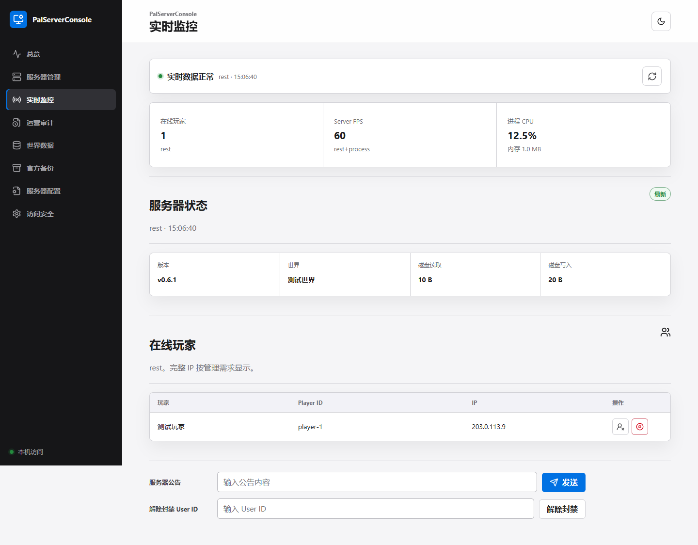

# PalServerConsole

PalServerConsole 是一个运行在 PalServer 同一台 Windows 主机上的中文本地 Web 控制台。它把服务器启动、状态查看、官方备份、世界数据快照、运行监控、审计记录和配置草稿集中到一个浏览器页面里。

首版的重点是：本地可用、操作有确认、数据有边界。控制台不保存独立的 LAN 密码；局域网访问直接使用游戏设置中的 `AdminPassword`。未配置 `AdminPassword` 时只监听 `127.0.0.1`，不会默认把控制台暴露到公网。

## 你能用它做什么

- 扫描 Steam 库并选择真实的 `PalServer.exe`。
- 启动、保存、停止和重启 PalServer；停止和重启前会先尝试保存世界。
- 在同一个“服务器管理”页面完成服务器生命周期操作，并查看 REST/RCON 状态、在线玩家、进程指标和实时数据新鲜度。
- 读取世界快照，查看玩家、据点和据点中的 Pal 数据。
- 管理官方 `backup\world` 备份，设置保留数量、删除备份和在停服后恢复。
- 查看运营审计记录，并在配置页编辑 `PalWorldSettings.ini` 草稿。
- 在检测到外部修改或服务器运行时，阻止高风险覆盖操作。
- 在本机明确确认后执行 SteamCMD 校验更新：检查在线玩家、通知、保存、停服、更新、校验、启动和健康检查；失败时只尝试重新启动，不会自动强制结束进程。
- 可选配置通用 HTTPS Webhook，只发送维护计划、开始、完成、取消和失败事件；Webhook 密钥不会回显到页面、日志或审计导出。
- 通过命名实例管理多个 PalServer/世界：每个实例有独立控制台、游戏和查询端口，以及数据目录、操作锁与配置/缓存/备份命名空间；重复绑定同一个 `PalServer.exe`、世界或游戏/查询端口会被拒绝。
- 检查维护者发布的最新 GitHub Release；Windows portable 可从维护页保留 `data/` 并完成控制台自更新，源码运行只提供下载入口。

## 界面预览



截图使用的是自动化测试中的合成数据，不是任何真实服务器、玩家或存档内容。
当前 Zoe 风格品牌插图为项目方使用 OpenAI GPT Image 2 生成的项目素材，并非 Palworld 官方 UI 或 Pocketpair 官方发布素材。

## 双击启动

以下步骤用于当前源码版本。构建出的 Windows 便携版解压后直接双击根目录的 `PalServerConsole.exe`；它自带运行时，普通使用者无需安装 Python 或 Node.js。详细说明见 [`docs/windows-portable.md`](docs/windows-portable.md)。

1. 安装 **64 位 CPython 3.13**，并勾选 **Add Python to PATH**。其他 Python 版本不属于本项目的构建和验证范围。
2. 安装 Node.js LTS。首次构建前端时需要，之后只有前端源码或锁文件发生变化时才需要重新构建。
3. 双击项目目录中的 `start-console.bat`。
4. 浏览器访问 [http://127.0.0.1:8223/](http://127.0.0.1:8223/)。

启动器会自动创建 `.venv`、安装 Python 依赖、按 `package-lock.json` 安装前端依赖并构建静态页面。生产运行只需要一个 Python/Uvicorn 进程，不需要让 Vite 常驻。

要启动第二个隔离实例，请为它指定唯一名称和控制台端口。例如在项目根目录运行：

```powershell
.\start-console.bat -InstanceId north -Port 18224
```

该实例的数据位于 `data\instances\north\`，与默认实例及其他命名实例隔离。便携版可对根目录 `PalServerConsole.exe` 使用同样的 `-InstanceId north -Port 18224` 参数；可为这条命令创建 Windows 快捷方式后双击启动。再在“服务器管理”的启动参数中为每套 PalServer 指定不同的 `-port` 与 `-queryport`（例如 `-port=8211 -queryport=27015`、`-port=8212 -queryport=27016`）；不要让两个实例绑定相同的 `PalServer.exe`、世界目录、游戏端口或查询端口。

> **多实例提醒：** PalServerConsole 主要面向单 PalServer 使用。多实例用户需要确保 Console、Game、Query、REST API、RCON 端口都不重复。当前版本对 Console 实例识别和 REST/RCON 跨实例冲突检查仍有已知限制。

启动失败时不要关闭窗口，请保留窗口中的英文错误信息。它通常能直接说明是 Python、Node.js、端口还是文件路径问题。

## 第一次设置

1. 打开“服务器管理”，点击“扫描 Steam”，或填写实际的 `PalServer.exe` 完整路径。
2. 检查启动参数和 `PalWorldSettings.ini` 中的 REST/RCON 端口是否一致。
3. 打开“服务器配置 → 面板设置 → 基本信息”，在“管理员密码”输入框中输入或更改游戏 `AdminPassword`，保存草稿并按提示停服应用；不输入新密码则保留原值。
4. 在“总览”页确认控制台监听端口；修改后重启控制台。在 Windows Firewall 中将规则限制为 `LocalSubnet`，不要把 `8223` 转发到公网。

本机访问默认免登录；局域网访问需要 `PalWorldSettings.ini` 中的游戏管理员密码。控制台启动时根据是否已配置 `AdminPassword` 决定监听地址；首次设置并应用密码后，需重启 PalServerConsole 才会开放 LAN。LAN 模式只适合可信内网，不是公网管理方案。

## 安全边界

- 已配置的 `AdminPassword` 不会从后端回显；未输入新密码时保留原值，修改时只提交用户当前输入的新值。局域网登录使用游戏管理员密码，因此只应在可信内网使用。
- 保存世界、停止、重启、备份恢复、备份删除和配置应用都需要明确操作。
- 生命周期操作、配置应用和备份写操作由同一控制边界串行执行；存在未完成的恢复事务时，启动、保存、重启和“重启并应用”会被阻止，必须先安全地 resume 或 rollback。
- 带 `Idempotency-Key` 的生命周期请求只有在操作类型、倒计时、消息和父操作完全一致时才会重放；同一 key 被用于不同请求时会返回 `IDEMPOTENCY_KEY_CONFLICT`，不会静默执行错误操作。
- 备份操作只接受官方 `backup\world` 下的直接子目录；活动世界没有删除 API。
- 配置先保存为草稿。检测到 `CONFIG_CONFLICT` 时不会自动覆盖外部修改。
- 真实服务器的恢复、配置应用和强制停止只应在用户批准的维护窗口执行。
- SteamCMD 更新没有默认定时器，也不会在停服超时后自动 force-stop。它要求本机输入 `UPDATE`，并在更新前后两次确认在线玩家为零；SteamCMD 出错后的恢复仅尝试重新启动现有安装，不能替代游戏文件回滚或维护窗口备份。
- 命名实例使用各自的 `data\instances\<实例名>` 数据目录和跨进程操作锁；同一根数据目录会登记并拒绝交叉的 `PalServer.exe`/世界写目标，以及重复的 PalServer 游戏/查询端口。
- Webhook 只支持无查询参数、无内嵌凭据的 HTTPS 地址。密钥仅作为本机提交内容保存到后端，读取接口不会返回它。

详细操作请阅读 [`docs/operations.md`](docs/operations.md)、[`docs/maintenance-window-checklist.md`](docs/maintenance-window-checklist.md) 和 [`docs/windows-portable.md`](docs/windows-portable.md)。

## 常见问题

| 页面提示 | 处理方式 |
| --- | --- |
| `GAME_ADMIN_PASSWORD_REQUIRED` | 在 `PalWorldSettings.ini` 配置游戏 `AdminPassword`，应用后重启控制台以开放可信 LAN 访问；未配置时仅监听 `127.0.0.1`。 |
| `SERVER_NOT_CONFIGURED` | 在“服务器管理”页选择有效的 `PalServer.exe`。 |
| `REST_CONNECTION_REFUSED` | 检查 PalServer 是否运行、REST 是否启用，以及端口是否与 `PalWorldSettings.ini` 一致。 |
| `SNAPSHOT_PENDING` | 保存文件变化后等待稳定窗口；成功缓存前世界页面会显示过期状态。 |
| `CONFIG_CONFLICT` | 在配置页查看差异，确认目标文件确实应被覆盖后再应用。 |
| `RESTORE_RECOVERY_REQUIRED` | 存在未完成的备份恢复；保持 PalServer 停止，先在备份恢复页面执行 resume 或 rollback。 |
| `IDEMPOTENCY_KEY_CONFLICT` | 请求 key 已用于不同操作；刷新页面后重新提交，客户端会生成新的 key。 |
| `ROLLBACK_FAILED` | 停止相关操作，保留英文错误详情，按维护清单使用安全副本人工回滚。 |

## 当前状态与未来方向

首版已经覆盖本地控制台的核心闭环，但仍有明确限制：真实服务器的恢复、配置应用和破坏性操作需要维护窗口；真实 RCON 降级还需要实际服务器只读验证。项目现在提供受锁文件约束的 Windows 便携版构建与安全升级脚本；实际公开发布前仍需完成干净 Windows 验收和签名决策，未签名包不得宣称已签名。

后续路线以公开的 [`CODEX_OPTIMIZATION_ROADMAP.md`](CODEX_OPTIMIZATION_ROADMAP.md) 为准，并按风险和用户收益排序：

1. **P0 生产收口**：完成真实只读运行验证、干净环境发布复现和日志/事件数据源边界确认。
2. **P1 便携交付**：构建机固定使用 64 位 CPython 3.13；交付内置 Python runtime 的 Windows 便携版，最终用户无需安装 Python/Node.js，并保证升级不覆盖 `data/`。
3. **P2 可选实时 bridge**：只有 REST 和存档数据不足时，才提供独立、只读、可禁用的 UE4SS bridge。
4. **P3 配置与网络安全**：先做 `WorldOption.sav` 只读解释和迁移预览，再考虑 HTTPS、反向代理和角色权限。

任意 RCON、存档编辑、地图坐标、受控远程访问和 UE4SS bridge 仍属于高风险后续方向，暂不承诺时间表。SteamCMD 更新与多实例/多世界现已提供受限的本机工作流，但尚未在真实 PalServer、真实 SteamCMD 更新或物理隔离的多实例主机上执行写入验证。

## 开发验证

在项目根目录执行后端检查：

```powershell
.venv\Scripts\python.exe -m ruff check backend
.venv\Scripts\python.exe -m mypy backend\palserver_console backend\tests
.venv\Scripts\python.exe -m pytest -q
```

在 `frontend` 目录执行前端检查：

```powershell
npm.cmd run lint
npm.cmd run typecheck
npm.cmd run test
npm.cmd run build
npm.cmd run test:e2e
```

构建 Windows 便携版（仅构建机需要 64 位 CPython 3.13 和 Node.js 24 LTS）：

```powershell
.\scripts\build-portable.ps1
```

正式构建默认要求 Git 工作区干净，否则以 `SOURCE_TREE_DIRTY` 停止，避免交付物声称来自无法重现的提交。仅进行本地验收、确实需要打包未提交代码时可显式使用 `-AllowDirtySource`；这类包会在 `build-info.json` 标记 `sourceTreeState: dirty`，不得作为正式发布包。

脚本会生成 `artifacts\PalServerConsole-<版本>-windows-x64.zip`、`checksums.sha256`、构建元数据，以及 Python 与前端 npm 运行时依赖的第三方许可证；不会对真实 PalServer、存档或现有 `data/` 进行写入。当前产物默认未签名。Palworld 游戏数据与 Release 的维护者流程见 [`docs/release-maintenance.md`](docs/release-maintenance.md)。

## 致谢

- 感谢 [deafdudecomputers/PalworldSaveTools](https://github.com/deafdudecomputers/PalworldSaveTools) 整理帕鲁英文资料和头像。本项目固定使用提交 `18b9554168ecf684c5f1e1e4d8e583083b942eb9` 中的选定 WebP，并保留 MIT License。
- 感谢 [zaigie/palworld-server-tool](https://github.com/zaigie/palworld-server-tool) 整理 Character ID 的简体中文映射。本项目固定使用提交 `f45a48ef25ce08a5311a27e55b17062ba0bb4362`，并保留 Apache License 2.0。

两份资料由 `scripts\sync-pal-catalog.ps1` 固定版本生成；完整来源、许可文件和 Pocketpair 权利声明见 `frontend/public/assets/pals/NOTICE.md` 与 `THIRD_PARTY_NOTICES.md`。

## 许可证

本项目自有源代码、脚本和文档采用 MIT License，完整文本见 [`LICENSE`](LICENSE)。该许可不改变 `THIRD_PARTY_NOTICES.md` 与 `frontend/public/assets/pals/` 中第三方代码、资料、头像、Palworld 角色名称和游戏数据的各自权利与许可证。

## 数据与公开发布

`data/`、数据库、日志、真实 `.sav`、前端构建产物、Playwright 截图、开发计划、交接记录和生成报告都由 `.gitignore` 排除。`fixtures/golden/` 只保留无标识的合成或真实存档派生计数基线；本地脱敏存档仍不会提交或公开分发。

提交更新前请检查：

```powershell
git status --short
git check-ignore -v plan.md docs\handoffs\M8.md data\app.db
```
