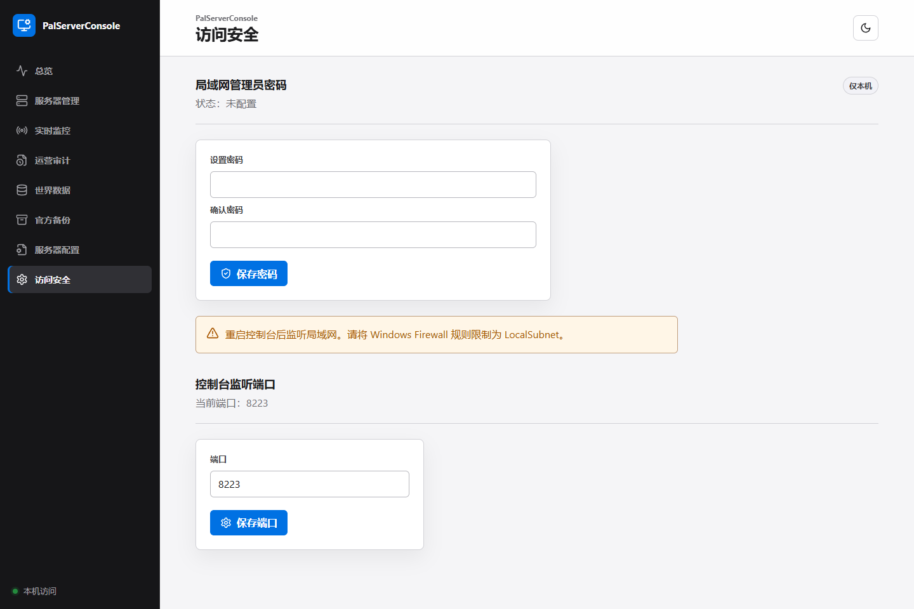

# PalServerConsole

PalServerConsole 是一个运行在 PalServer 同一台 Windows 主机上的中文本地 Web 控制台。它把服务器启动、状态查看、官方备份、世界数据快照、运行监控、审计记录和配置草稿集中到一个浏览器页面里。

首版的重点是：本地可用、操作有确认、数据有边界。它不会把 PalServer 的管理密码、RCON 密码或 LAN 密码发送给浏览器，也不会默认把控制台暴露到公网。

## 你能用它做什么

- 扫描 Steam 库并选择真实的 `PalServer.exe`。
- 启动、保存、停止和重启 PalServer；停止和重启前会先尝试保存世界。
- 查看 REST/RCON 状态、在线玩家、进程指标和实时数据新鲜度。
- 读取世界快照，查看玩家、据点和据点中的 Pal 数据。
- 管理官方 `backup\world` 备份，设置保留数量、删除备份和在停服后恢复。
- 查看运营审计记录，并在配置页编辑 `PalWorldSettings.ini` 草稿。
- 在检测到外部修改或服务器运行时，阻止高风险覆盖操作。

## 界面预览




截图使用的是自动化测试中的合成数据，不是任何真实服务器、玩家或存档内容。

## 双击启动

1. 安装 Python 3.11、3.12 或 3.13，并勾选 **Add Python to PATH**。
2. 安装 Node.js LTS。首次构建前端时需要，之后只有前端源码或锁文件发生变化时才需要重新构建。
3. 双击项目目录中的 `start-console.bat`。
4. 浏览器访问 [http://127.0.0.1:8223/](http://127.0.0.1:8223/)。

启动器会自动创建 `.venv`、安装 Python 依赖、按 `package-lock.json` 安装前端依赖并构建静态页面。生产运行只需要一个 Python/Uvicorn 进程，不需要让 Vite 常驻。

启动失败时不要关闭窗口，请保留窗口中的英文错误信息。它通常能直接说明是 Python、Node.js、端口还是文件路径问题。

## 第一次设置

1. 打开“服务器管理”，点击“扫描 Steam”，或填写实际的 `PalServer.exe` 完整路径。
2. 检查启动参数和 `PalWorldSettings.ini` 中的 REST/RCON 端口是否一致。
3. 如果需要局域网访问，在“访问安全”页设置至少 10 位 LAN 密码，然后重启控制台。
4. 在 Windows Firewall 中将规则限制为 `LocalSubnet`，不要把 `8223` 转发到公网。

本机访问默认免登录；局域网访问需要管理员密码。LAN 模式只适合可信内网，不是公网管理方案。

## 安全边界

- 浏览器不会接触 PalServer `AdminPassword`、RCON 密码或 LAN 密码。
- 保存世界、停止、重启、备份恢复、备份删除和配置应用都需要明确操作。
- 备份操作只接受官方 `backup\world` 下的直接子目录；活动世界没有删除 API。
- 配置先保存为草稿。检测到 `CONFIG_CONFLICT` 时不会自动覆盖外部修改。
- 真实服务器的恢复、配置应用和强制停止只应在用户批准的维护窗口执行。

详细操作请阅读 [`docs/operations.md`](docs/operations.md) 和 [`docs/maintenance-window-checklist.md`](docs/maintenance-window-checklist.md)。

## 常见问题

| 页面提示 | 处理方式 |
| --- | --- |
| `LAN_PASSWORD_REQUIRED` | 在服务器本机设置 LAN 密码，然后重启控制台。 |
| `SERVER_NOT_CONFIGURED` | 在“服务器管理”页选择有效的 `PalServer.exe`。 |
| `REST_CONNECTION_REFUSED` | 检查 PalServer 是否运行、REST 是否启用，以及端口是否与 `PalWorldSettings.ini` 一致。 |
| `SNAPSHOT_PENDING` | 保存文件变化后等待稳定窗口；成功缓存前世界页面会显示过期状态。 |
| `CONFIG_CONFLICT` | 在配置页查看差异，确认目标文件确实应被覆盖后再应用。 |
| `ROLLBACK_FAILED` | 停止相关操作，保留英文错误详情，按维护清单使用安全副本人工回滚。 |

## 当前状态与未来方向

首版已经覆盖本地控制台的核心闭环，但仍有明确限制：真实服务器的恢复、配置应用和破坏性操作需要维护窗口；真实 RCON 降级还需要实际服务器只读验证；当前没有自动更新器或独立安装包。

后续路线以 `plan.md` 为准，并按风险和用户收益排序：

1. **P0 生产收口**：完成真实只读运行验证、干净环境发布复现和日志/事件数据源边界确认。
2. **P1 便携交付**：提供无需用户安装 Python/Node.js 的 Windows 便携版，并保证升级不覆盖 `data/`。
3. **P2 可选实时 bridge**：只有 REST 和存档数据不足时，才提供独立、只读、可禁用的 UE4SS bridge。
4. **P3 配置与网络安全**：先做 `WorldOption.sav` 只读解释和迁移预览，再考虑 HTTPS、反向代理和角色权限。

任意 RCON、存档编辑、地图坐标、SteamCMD 更新、多实例和多世界都属于高风险后续方向，暂不承诺时间表。它们必须先补齐权限、备份、回滚和维护窗口设计，不代表首版已经提供。

## 开发验证

在项目根目录执行后端检查：

```powershell
.venv\Scripts\python.exe -m ruff check backend
.venv\Scripts\python.exe -m mypy backend\palserver_console backend\tests
.venv\Scripts\python.exe -m pytest -q
```

在 `frontend` 目录执行前端检查：

```powershell
npm.cmd run lint
npm.cmd run typecheck
npm.cmd run test
npm.cmd run build
npm.cmd run test:e2e
```

## 数据与公开发布

`data/`、数据库、日志、真实 `.sav`、前端构建产物、Playwright 截图、开发计划、交接记录和生成报告都由 `.gitignore` 排除。`fixtures/` 只保留安全说明和目录忽略规则；本地脱敏样本不会提交或公开分发。

提交更新前请检查：

```powershell
git status --short
git check-ignore -v plan.md docs\handoffs\M8.md data\app.db
```
