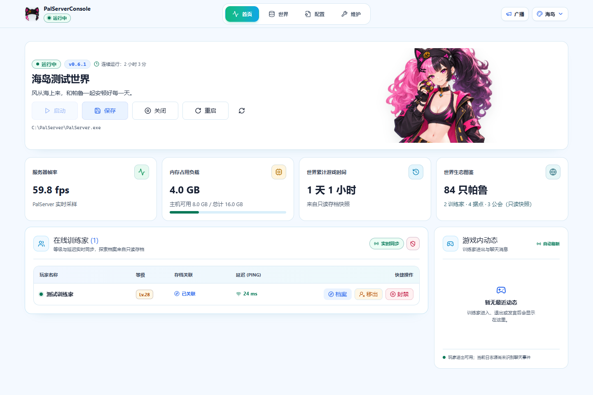
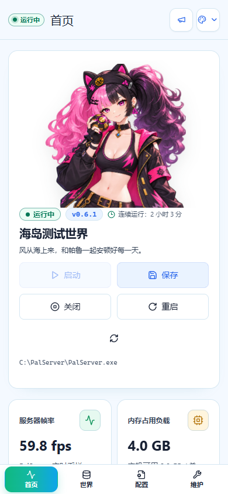
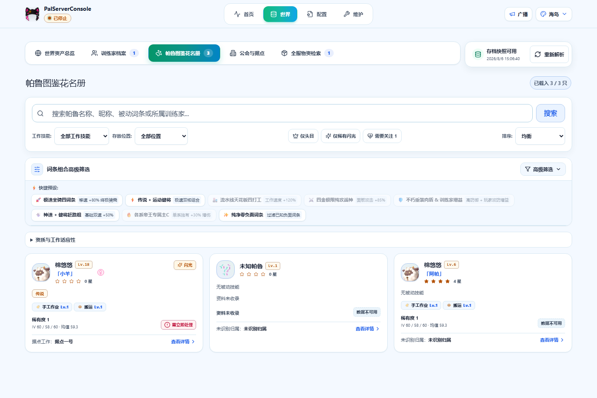
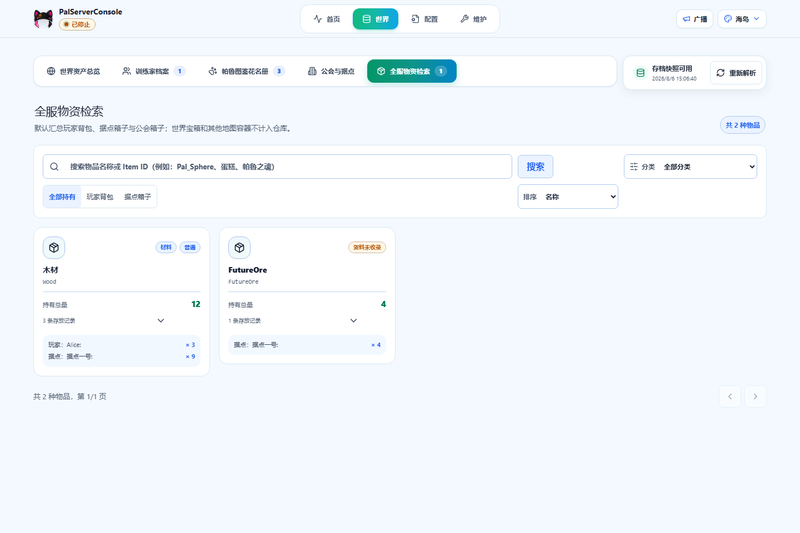

<p align="center">
  
</p>

# PalServerConsole

**打理服务器，也看见你的整个帕鲁世界。**

面向自建服服主的中文本地 Web 控制台。启停服务器、查看在线训练家、筛选帕鲁、寻找物资、调整世界法则、恢复官方备份，都从这里出发。

**Windows 本机运行 · 桌面与手机 · 三种主题 · MIT 开源**

[逛逛海岛](#逛逛海岛) · [项目特色](#项目特色) · [快速开始](#快速开始) · [使用须知](#使用须知)

## 逛逛海岛

### 🏝️ 首页 · 你的服务器值守站

启动、保存、关闭、重启集中在首页；运行指标、在线训练家和游戏内动态各有位置。服务器是否在运行、谁在岛上、哪些数据暂不可用，一眼就能看清。



<details>
<summary><strong>📱 用手机登岛</strong></summary>

<p align="center">
  
</p>

在可信局域网中，手机浏览器也能进入同一套控制台，查看状态、浏览世界数据和处理日常操作。

</details>

### 🐾 帕鲁名册 · 找到值得关注的那一只

从物种、昵称到被动词条，从个体值、工作适应性到照护状态，让全服帕鲁有据可查。物种名帮助识别，昵称保留个性，详情继续连接训练家与据点。



### 📦 全服物资 · 从“有多少”找到“放在哪”

按物品名称或 Item ID 搜索，按分类、玩家背包和据点箱子缩小范围，再展开存放分布。未知物品保留原始 ID，资料缺失也有明确提示。



## 项目特色

### 🧭 四个入口，串起服主的日常

| 入口 | 核心能力 |
| --- | --- |
| **首页** | 服务器启停与保存、运行监控、在线训练家、全服广播。 |
| **世界** | 资产总览、训练家档案、帕鲁名册、公会与据点、全服物资检索。 |
| **配置** | 世界法则、INI / SAV 配置来源、控制台与实例设置。 |
| **维护** | 官方备份、恢复与审计、控制台更新、维护事件 Webhook 通知。 |

### 🔎 从全服总览，走到一个具体对象

- **帕鲁筛选更细**：物种与昵称、等级与星级、个体值、工作适应性、被动词条组合，以及闪光、头目和需要照护的个体。
- **关系可以继续追查**：从训练家查看帕鲁，从公会进入成员与据点；帕鲁位置区分随身队伍、帕鲁终端和据点工作。
- **物资分布可以展开**：先看全服数量，再查玩家背包与据点箱子，沿存放位置继续查看。
- **成长进度有出处**：训练家档案展示存档中可用的探索与成长记录，缺失字段明确标注。

### 🌊 世界看得深，存档保持只读

在线状态来自官方 REST 和 Windows 进程；帕鲁、物资、公会与据点来自**只读存档快照**。两类数据分别显示更新时间，世界快照不冒充实时状态。

存档在独立工作进程中解析，派生缓存支撑检索。解析失败时保留最后成功结果，并提示过期状态与错误；世界浏览不修改真实 `.sav`。

### ⚙️ 配置有来源，维护有回路

支持 `PalWorldSettings.ini` 与当前世界的 `WorldOption.sav`。运行中的修改保存为待应用配置；写入前保留备份，完成后回读校验。官方备份恢复先保留安全副本，中断时可继续恢复或回滚。

已有待应用配置时，需先应用再保存另一配置文件或其他世界的修改。若同一配置项被外部修改，会保留原文件和待应用修改，读取最新配置并重新保存冲突项后再应用；旧版待应用配置缺少冲突基准时，需按提示重新保存全部待应用字段。

控制台更新与游戏服务器更新分开：Windows 便携版支持本机确认后退出、升级并重新启动；维护事件可通过 HTTPS Webhook 通知。

### 🌤️ 白天、海岛、夜色，都有合适的界面

内置 **轻爽极简 / 灵动海岛 / 深邃夜色** 三种主题，适配桌面和手机。便携版自带运行时；同机管理多套服务器时，可使用命名实例分隔数据目录、控制台端口与操作锁。

## 快速开始

控制台需要与 **PalServer 运行在同一台 Windows 主机**。

### 解压即用

使用维护者提供的 Windows 便携包：

1. **解压整个包**到可写的本地目录。
2. 双击 **`PalServerConsole.exe`**，等待浏览器打开。
3. 在首页扫描 Steam 库，或填写 **`PalServer.exe`** 的完整路径。

无需安装 Python 或 Node.js。默认访问 [127.0.0.1:8223](http://127.0.0.1:8223/)；端口被占用时会尝试 `18223`。运行数据保存在根目录 `data/`。

### 从源码启动

准备 **64 位 CPython 3.13、Node.js 24 LTS、npm ≥ 11.17**，在项目根目录执行，也可直接双击：

```powershell
.\start-console.bat
```

启动器会创建虚拟环境、安装依赖并构建前端，随后打开本地控制台。首次连接时，核对 PalServer 的 REST / RCON 开关与端口；存在 `WorldOption.sav` 时，以有效配置为准。

<details>
<summary><strong>手机访问与多实例</strong></summary>

**手机访问**：在配置页设置游戏 `AdminPassword`，应用后重启控制台，再通过主机的局域网 IP 和控制台端口访问。Windows Firewall 规则应限制为 `LocalSubnet`。

**第二套实例**：

```powershell
.\start-console.bat -InstanceId north -Port 18224
```

该实例的数据位于 `data\instances\north\`。每套 PalServer 还需使用独立的程序、世界目录及游戏、查询、REST、RCON 端口；详见[日常运维说明](docs/operations.md)。

</details>

## 使用须知

- **本机优先，可信内网可用**：本机默认免登录；LAN 使用游戏 `AdminPassword`。未配置密码时仅监听 `127.0.0.1`，控制台端口不要直接暴露到公网。
- **世界查询只读**：不提供存档编辑、传送或任意 RCON 终端；派生缓存不能代替官方备份。
- **真实写入安排维护窗口**：恢复、配置应用与强制停止需核对目标和前置条件。真实服务器写入与多实例主机隔离尚未完成全面验收。
- **更新对象是控制台**：当前不提供 SteamCMD 游戏服务器更新；Windows 便携包默认未签名。

[日常操作与故障处理](docs/operations.md) · [便携版与升级](docs/windows-portable.md) · [维护窗口清单](docs/maintenance-window-checklist.md)

## 技术与许可

**React · TypeScript · Vite** / **Python · FastAPI · SQLite** / **palworld-save-tools**

帕鲁英文资料与头像来自 [PalworldSaveTools](https://github.com/deafdudecomputers/PalworldSaveTools)，简体中文映射来自 [palworld-server-tool](https://github.com/zaigie/palworld-server-tool)。来源与许可详见[帕鲁素材声明](frontend/public/assets/pals/NOTICE.md)和[第三方声明](THIRD_PARTY_NOTICES.md)。

项目自有代码、脚本和文档采用 [MIT License](LICENSE)。第三方素材、角色名称与游戏数据保留各自权利。
